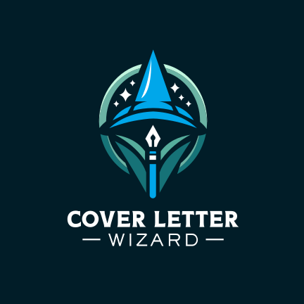

<br>
<p align="center">
<a href="https://joshwilger.github.io/cover-letter-wizard/" target="_blank" rel="noopener">

</a>

</p>

<p align="center">
  Speech to text <b>cover letter writing interview</b> powered by <b>ChatGPT 4</b> 🧑‍💻👩‍💻👨‍💻
</p>

<p align="center">
  <a href="https://tech-interview-gpt.vercel.app/" target="_blank" rel="noopener">try Cover Letter Wizard</a>
</p>

<br>

## Features

- 🧑‍💻 **Cover Letter Feedback** - Provides in-depth <b>feedback</b> and <b>improved revisions</b> for cover letters powered by <b>ChatGPT 4</b>.
- 🛠 **Customized Interviews** - Questions asked by the Wizard will be based on previous answers given.
- 🎙 **Speech Recognition** - <b>Record</b> and <b>edit</b> answers using <b>speech recognition</b> (<a href="https://developer.mozilla.org/en-US/docs/Web/API/Web_Speech_API#browser_compatibility" target="_blank" rel="noopener">See browser compatibility</a>).
- 📝 **Interview Log** - Automatically saves the interview <b>history</b> for viewing previous interviews.
- 💻 **Device Friendly** - <b>responsive design</b> for various devices.

<br>

## Getting Started

### Try it Online

[Cover Letter Wizard](https://joshwilger.github.io/cover-letter-wizard/)

### Init Project Locally

Install [Node.js](https://nodejs.org/) and run the following command:

```bash
npm run start
```

<br>

## Tech Stack

- [Vite](https://vitejs.dev) - An extremely fast frontend tooling.
- [React](https://react.dev/) - A Declarative, Component-based JavaScript library for building user interfaces.
- [Tailwind CSS](https://tailwindcss.com/) - A utility-first CSS framework for rapid UI development.

<br>

## License

MIT License © 2024 [Josh Wilger](https://github.com/joshwilger)
